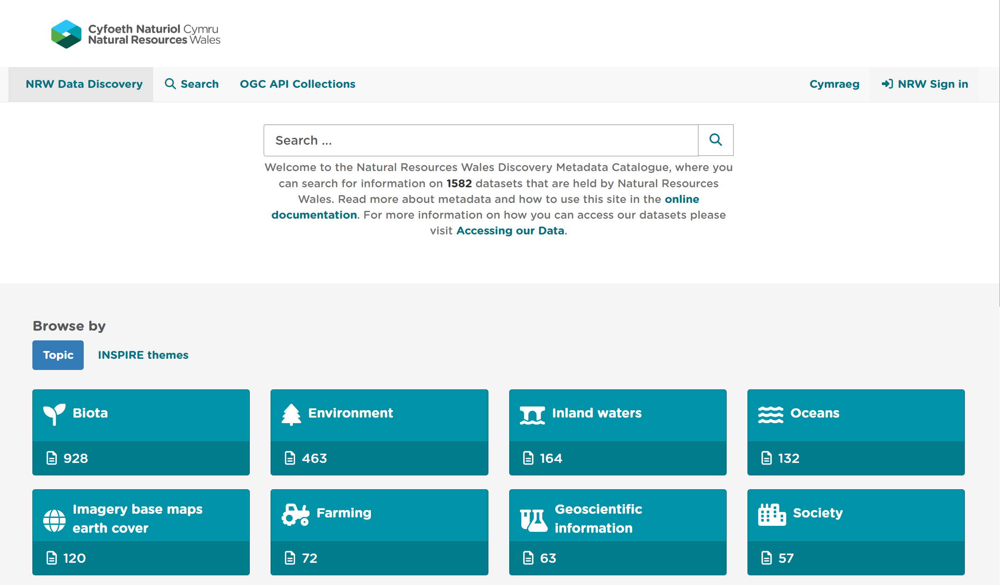
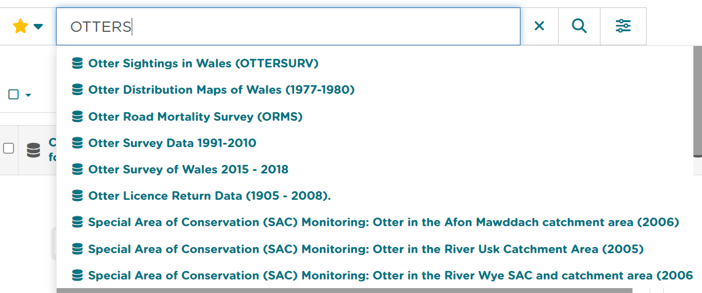
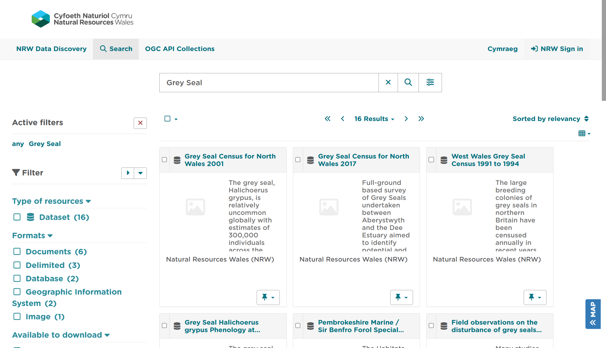
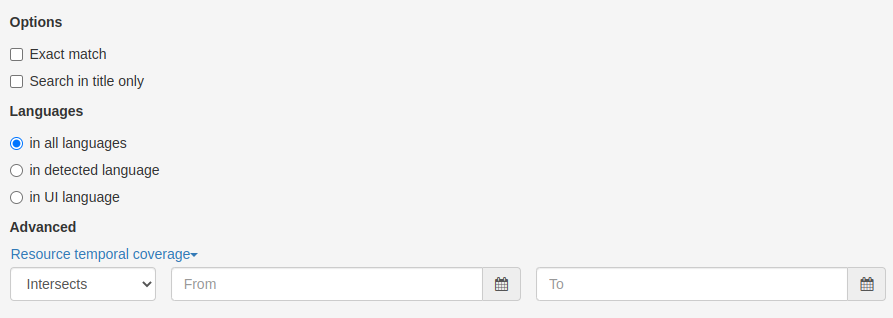
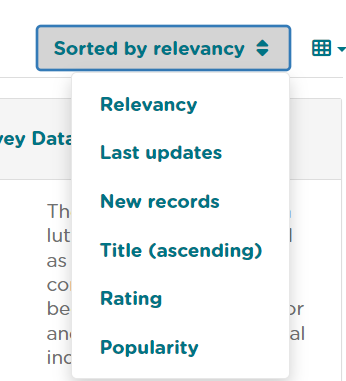
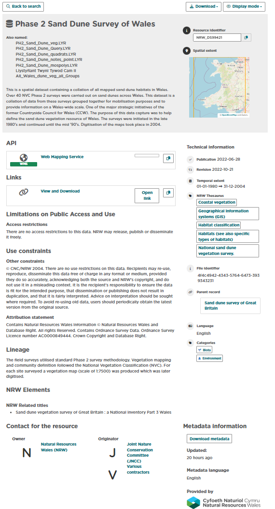
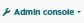

Searching for Metadata
======================

This section will guide users and guests to the site on how to search and filter metadata provided by data publishers to `Natural Resources Wales Discovery Metadata catalogue <https://metadata.naturalresources.wales/geonetwork>`__.

Accessing the portal
--------------------

The portal can be accessed from the following links:

`Natural Resources Wales Metadata catalogue - <https://metadata.naturalresources.wales/geonetwork>`__

The home page of the portal comprises of a basic search bar at the top, and also provides the option to browse by topic category (default) or
by INSPIRE theme. Tabs in the header menu give access to the main **search** page and selecting **Cymraeg** will switch users to the welsh version of the catalogue. NRW Staff can use the **Sign-in** option to log-in via single sign on to edit and create metadata records where access is allowed and to also access metadata elements that are resticted to public access 
clicking the portal name on the header menu will
return the user to the home page.

|userdoc_fig_2_1_1_Home|

**Figure 2.1.1:** Home page

When logged in, registered users of the site will be presented with further buttons on the header menu for |button_contribute| and |button_adminconsole| (for user and site administrators).
The |button_contribute| menu gives options to navigate to the **Editor board**, `add a new record <UserDoc_Chap4_Create.html#creating-metadata-from-a-template>`__,
`import new records <UserDoc_Chap4_Create.html#importing-existing-metadata>`__, `manage directory <UserDoc_Chap4_Create.html#creating-directory-metadata>`__,
`batch editing <UserDoc_Chap5_Edit.html#batch-editing>`__ and access rights.

Basic searching
---------------

Quick searches on the portal can be performed directly from the home page using the search box and clicking the search button (|button_search_icon|).

*Note: To search using the metadata's Unique Resource Identifier and to create a wildcare search you can use the asterisk key. For precise search results use " " in your search e.g."Areas of Outstanding Natural Beauty".

|userdoc_fig_2_2_1_NRWBasicSearch|

**Figure 2.2.1:** A basic search from the home page

This will take the user to the main search panel, showing the resulting records in the centre of the page, with additional filtering options to the
left. The user can also access the main search panel by clicking |button_search| on the top menu of the home page. To the bottom right of the
page is a small map view showing the geographic extents of the queried results. This can be minimised by clicking the collapse button on the right of the map.

|userdoc_fig_2_2_2_SearchResults|

**Figure 2.2.2:** Search results displayed on the main search panel

Advanced searching
------------------

If you are wanting to create an advanced search within Data Discovery there are advanced search functionality which you can find in the main search page by clicking on this icon INSERT THE ICON HERE. **Exact Match** means the search result will only return results for what you have entered in the search e.g. entering brown trout will not give you returns for records that only contain the word trout. The other advanced search option is **Search in title only**, this functionality will remove the elastic search options of the basic search and when selected will only look in the title element of metadata records and not in other elements such as abstract.

Filter and sort options
-----------------------

Search results can be limited using the options available in the left-hand panel. Each search filter shows the number of records returned next to
it. Filtering options available are as follows:

* **Type of resources** (e.g. datasets or services)
* **Format Type**
* **Available to Download**
* **INSPIRE Theme**
* **Responsible Organisation (Owner)**

At the top right of the search results list, there is a menu to sort the results by **title**, **relevance**, **most recently updated**, **rating** and **popularity**. At the top left of the results list users can select all results, all results on the current page, or none to deselect. Upon
selection users can choose to export the results to a zip, pdf or csv file. Note that registered users will be able to perform additional actions,
such as `publish <UserDoc_Chap5_Edit.html#publishing-metadata>`__ (if they have Reviewer privileges) or `delete <UserDoc_Chap5_Edit.html#deleting-metadata>`__
(if they have Editor privileges), or submit for approval on selected records.

|userdoc_fig_2_4_1_NRWSortOptions| 

**Figure 2.4.1:** Sort options

.. |button_contribute| image:: media/button_contribute.png

