Viewing Metadata and Data
=========================

This section will guide users and visitors to the site on viewing metadata and previewing data using the interactive map.

Viewing metadata records
------------------------

Clicking on the title of a record (from either the search results or those presented on the main page) will allow the user to view the metadata
record. Below the record title, the **abstract** provides a brief description of what the dataset (or service) is and what it is used for. The
**spatial extent** of the resource can be seen in the map to on the right with the metadata Unique Resource Identifier (URI) above it. Where datasets have gone through an internal NRW Open Data Assessment and has been classified as available under an Open Government Licence (OGL) you will be able to easily identify these with the OGL logo sitting alongside the URI. In cases where the dataset is published and is available to download you will be able to follow a link to the dataset under the **Links** sub-heading. Below this you will find the datasets *Access and use constraints* information which can assist staff in determining if the dataset is suitable for public access and use. Scolling down the page you will find more information on the dataset includiong how it was created and information warnings in the **Lineage** and also citations for reports linked to the dataset in the **Addtional Information Source** section. To the right of the screen you can find **Technical Information** which provides details on **Publishing Dates** (when the data was published, created or revised), **Temporal Extent** (The date range of the data collection), **Language**, **Keywords** and **Topic Categories**, **Data format** (The form the data takes). 

*Note: NRW Staff when logged in will also be able to view the datasets* **Internal Location** *and the* **Internal Contact** *which is the metadata custodian.*

**Links** section.

|userdoc_fig_3_1_1_DefaultViewA|

**Figure 3.1.1:** Default record view

Note that the default view for a metadata record displays a summary of the information in the record. The **full view** will show users more detailed information of the dataset including potential Geospatial details such as the **Spatial Resolution** and **Spatial Reference System** alongside other details. To change the display view of the metadata
record:

	**1|** Click on |button_view_display| at the top right of the record.

	**2|** Choose 'Full view' to display a detailed view of the record.

Exporting metadata records
--------------------------

Metadata records can be exported from Data Discovery via the download icon menu at the top right of the record. To export a record:

	**1|** Click on |button_view_download| at the top right of the record.

	**2|** Choose the format to export (ZIP, PDF or XML). The permalink option will provide a URL for the record that can be copy and pasted.

Data Discovery also has the abiltiy to download multiple metadata records at once in the same formats listed above. To do this you can search for the datasets you require to download and tick the small box to the left of the dataset title. Once you have selected all the records you want to export you can click the **selected** button alongside the page numbering and then select which download format you would like. 

|userdoc_fig_3_2_1_ExportMetadata|

.. |userdoc_fig_3_1_1_DefaultViewA| image:: media/userdoc_fig_3_1_1_DefaultViewA.png
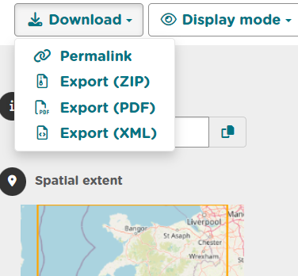
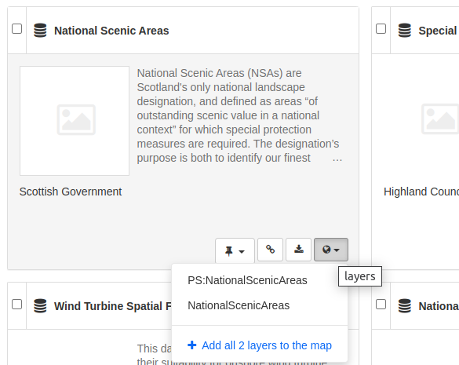
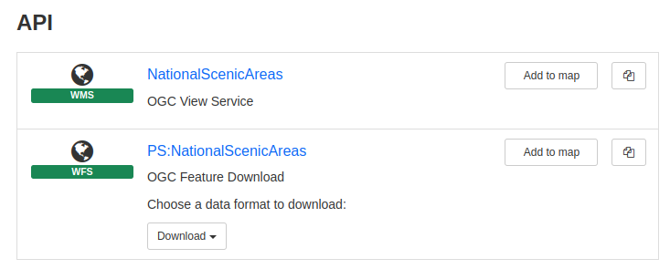
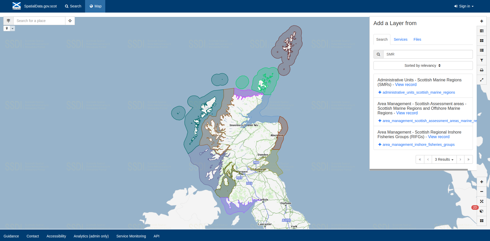
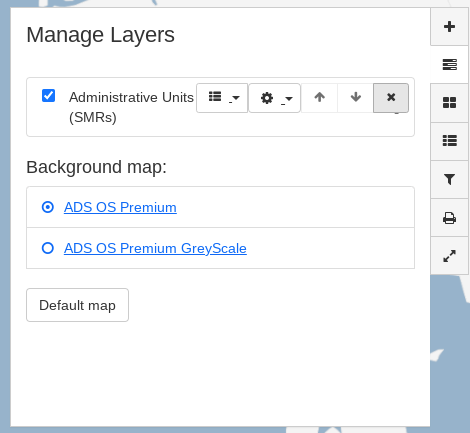
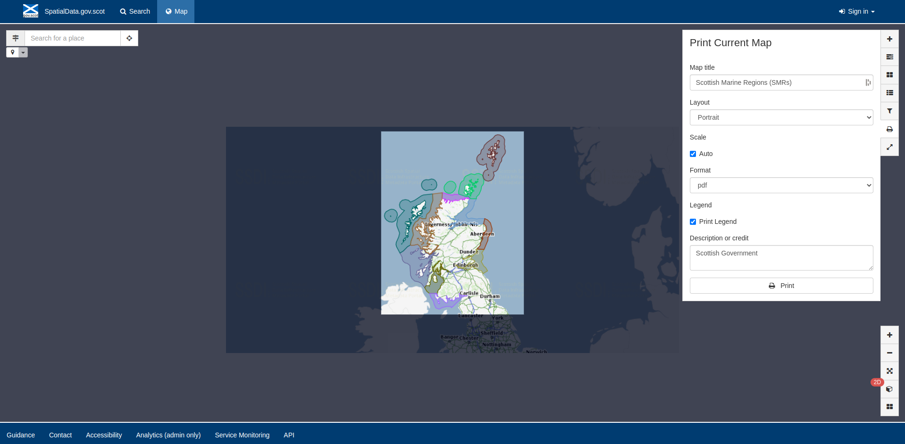
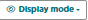
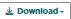
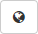

.. |button_map_addlayer| image:: media/button_map_addlayer.png
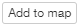
.. |button_view_addtomap| image:: media/button_view_addtomap.png

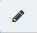
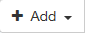
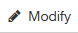
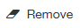

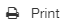
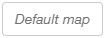

.. |button_map_projection| image:: media/button_map_projection.png

