Editing Metadata
================

This section will guide the user through editing a metadata record on `Data Discovery <https://metadata.naturalresources.wales/geonetwork/srv/eng/catalog.search#/home>`__, compliant to NRW Metadata Standards.
In most cases, the basic functionality provided by the *default view* of an editing sessions will be sufficent for the users need, however, in
some instances additional functionality from the *advanced view* may be required.

Starting an editing session
---------------------------

Editors will be able to edit any records they have contributed to the portal, or if they have appropriate privileges to edit records submitted by
others (e.g. administrators).

To begin an editing session:

	**1|** Sign in using your account credentials.

	**2|** Either search for a particular record direct from the home page or click |button_contribute| in the header and select |button_editor_board| to open the **Editor** board and search or scroll for the record.

	*Note: if the 'only my records' box at the top left of the Editor board is checked, this will limit the record list to only those belonging to that user.*

	**3|** Click the pencil icon (|button_contribute_pencil|) visible in the search results list, or next to the record name on the **Editor** board. This will enter the user into an editing session.

	*Note: users can also start an editing session from the record view page by clicking* |button_view_edit| *at the top of the page.*

Editing basics
--------------

Once in an editing session, the user is presented with the simple *default* editing view. In the header menu, buttons are available for modifying
the categories, group that the record belongs to, validation, cancelling the edit session, and saving the record. On the right side of the page,
the `Associated resources <#associated-resources>`__ panel is visible, showing all related online resources such as links to locate the dataset if it is published by NRW and related datasets.

The form displays the metadata elements grouped into relevant sections. The user can navigate through the form using the *table of contents*
visible in the lower right of the screen (click |button_edit_toc| to display). Clicking an element section will take the user to the relevant section of the form. The user can
collapse all elements of the form by clicking the |button_edit_collapse| button visible just below the header. Clicking on a section title will
re-expand that section. The |button_edit_arrowup| and |button_edit_arrowdown| buttons allow the user to place the section further up or down the document order.
Note that UK Gemini is only concerned with whether the elements (or sections) are present and correct, not with the order they are displayed.

Mandatory fields are highlighted with a red asterisk. Note that for sub-elements, this only indicates that the
sub-element is mandatory within its context. For example, the vertical extent is an optional element, but if the
record requires one, then the minimum and maximum values are mandatory.

Where a |button_edit_plus| button is displayed, the user can click this to add another occurrence of an element or section. For example, a record
could have more than one alternative title. When the user hovers over a section and a |button_edit_delete| appears,
clicking the cross will delete that element or section.

Some elements in Data Discovery allow users to include the Welsh translation of the text. It is not mandatory to have the translations but please include if available.

|userdoc_fig_6_2_1_DefaultEdit|

**Figure 6.2.1:** The default view of the editing session interface

Changing the editing view
-------------------------

Sometimes it will be necessary for the user to change the view to enable additional functionality. For example, to add a new occurrence of an element
when the |button_edit_plus| is not visible in the default view.

To change the view of editing session:

	**1|** Click on |button_edit_view| on the top right of the editing board.

	**2|** From the dropdown menu, choose either Default, Advanced or XML. Advanced (full) view is a more detailed version of the default (simple) view, where as XML view allows the user to edit the raw XML.

	*Note: users can also enable tool tips from the view menu.*

|userdoc_fig_6_3_1_AdvancedEdit| |userdoc_fig_6_3_1_XMLEdit|

**Figure 6.3.1:** Advanced editing and XML view

Assigning a licence category
----------------------------

Records can be classified based on their licence type (i.e. Open Government, Non-commercial Government, INSPIRE or other) using the
assign category function. This classification can be done either in an editing session, via the contribute board, or when a record is imported
into the `Natural Resources Wales Metadata catalog <https://metadata.naturalresources.wales/geonetwork>`__.

To assign or change the licence category in an editing session:

	**1|** Click on |button_edit_category| in the header.

	**2|** From the dropdown menu, check the appropriate licence type (Open Government, Non-commercial, INSPIRE or other).

	**3|** Click anywhere to dismiss the menu.

|userdoc_fig_6_4_1_LicenceCategory|

**Figure 6.4.1:** Assigning a licence category in an editing session

To assign or change the licence category via the contribute board:

	**1|** Click on |button_contribute| in the header.

	**2|** Click the |button_editor_board| button. This will enable the **Editor** board, where all records the user has access to will be listed.

	**3|** In the record list, select the record(s) for which the licence category will assigned or amended.

	*Note: the licence category can be updated for multiple records at a time.*

	**4|** Click the dropdown labelled 'selected' at the top left of the record list and choose 'Update licence' from the list. This will display the licence categories dialog.

	**5|** From the menu, check the appropriate licence type (Open Government, Non-commercial, INSPIRE or other).

	**6|** Click |button_contribute_replace| to apply the changes.

The licence category can also be assigned using the appropriate option when importing a record. For those organisations which harvest
their metadata records into the portal, a default licence type can be selected for all records, though any records that differ from the default setting
would need to be amended post harvest.

Validating metadata
-------------------

Once all elements for a new record have been completed or changes have been made to an existing record, it should be validated against the appropriate metadata standard.

For Geospatial Datasets please also validate against UK GEMINI Standard Draft Version 2.3 and Natural Resources Wales Metadata Profile

For Marine Datasets please also validate against MEDIN Discovery Metadata Profile.

To validate a metadata record:

	**1|** In an editing session, click on the |button_edit_validate| button in the header bar.

	**2|** Errors will be highlighted in the validation panel. Click the red thumbs-down icon (|button_edit_thumbsdown|)to see details of the error(s) organised by schematron. Pleant note that any errors in standards that are highlighted as supplemental these are not mandatory elements and can be a valid record when not completed.

	**3|** Correct errors as necessary and repeat steps 1 and 2 until no errors are returned by the validator.

	*Note: users can save an invalid record and return at a later date to correct.*

|userdoc_fig_6_6_1_ValidationPanel|

**Figure 6.6.1:** Validation panel

The validation check should be repeated once amendments have been made until no errors are detected.

Saving and exiting an editing session
-------------------------------------

As the user works through the editing form, it is recommended that progress be saved periodically as the session will time-out after a period of
inactivity.

To save a metadata record:

	**1|** Click |button_edit_save| to save the record and continue editing, or click |button_edit_saveclose| to save the record and exit the editing session.

	*OR*

	**1|** Click |button_edit_cancel| to exit the editing session without saving the record.

Users should note that a saved record will be stored on the server only (not locally). The server is periodically backed up, though it is
recommended that users store master copies of their metadata records within their own systems. To export copies of metadata created on the portal,
consult the `exporting metadata <UserDoc_Chap3_Viewing.html#exporting-metadata-records>`__ section.

Publishing metadata
-------------------

Once a metadata record has been successfully `validated <#validating-metadata>`__, it will need to be approved by a Data Discovery Reviewer or Administrator to make it available for public viewing.

To send a metadata record for approval:

1] Save and close your metadata record while will return you to your metadata record default view.

2] Under **Manage record** you can select **Send for Approval**. 

3] A pop-up box will appear where you can include a personalised message to the reviewer. An email will then be sent to the metadata reviewer to review and approve for publishing.

If the record has not yet been submitted it will be tagged as **draft** in the editor board and after it is submitted it will then be tagged as **submitted. 

Once the record is published, the padlock icon displayed on the Editor board should appear unlocked and it will be tagged as **approved** (|button_contribute_unlocked|). 

|userdoc_fig_6_8_1_PrivilegesPanel|

Batch editing
-------------

Administrators will have the privileges to perform batch editing on records. See the `Administrator Guidance <adminguidance.html#batch-editing>`__ for more information.

Deleting metadata
-----------------

Users with the appropriate privileges will be able to edit or delete records from the portal.

To delete a metadata record:

	**1|** Click on |button_contribute| in the header.

	**2|** Click the |button_editor_board| button. This will enable the **Editor** board, where all records the user has access to will be listed.

	**3|** Locate the metadata record in the list below.

	**4|** Click on the |button_contribute_delete| in the row for the record.

	**5|** A confirmation prompt will be displayed. Click 'OK' to confirm the deletion.

	*Note: the record may still appear in the list until the page is refreshed.*

|userdoc_fig_6_10_1_NRWDeleteRecordConfirm|

**Figure 6.10.1:** Confirmation requested to delete a metadata record

Alternatively, the user can delete a record directly from the record's page by clicking the |button_view_delete| button.

*Note: A confirmation prompt will be displayed. Click 'OK' to confirm the deletion.*

Users should note that when deleting a record that had previously been published, that record will not be deleted from other portals which may have
harvested the record, such as `data.gov.uk <http://data.gov.uk/>`__. Users should contact `Natural Resources Wales <mailto:opendata@cyfoethnaturiolcymru.gov.uk?subject=Data%20Discovery%20Enquiry>`__
to have records deleted from `data.gov.uk <http://data.gov.uk/>`__.

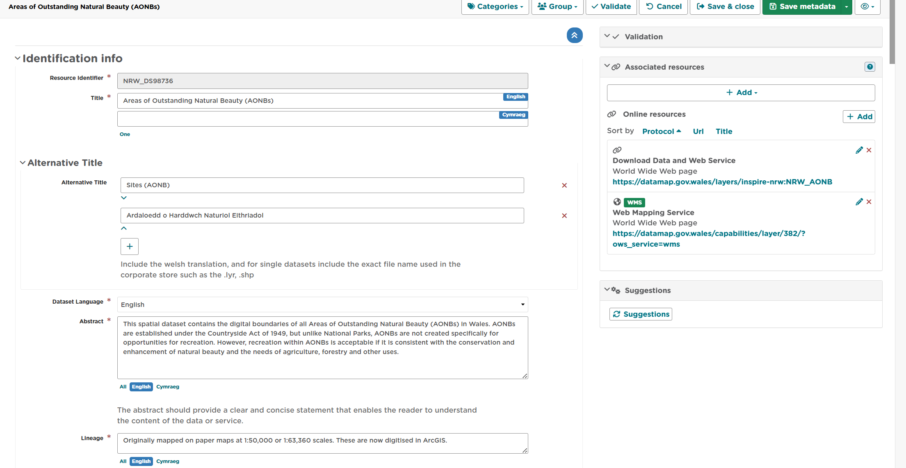
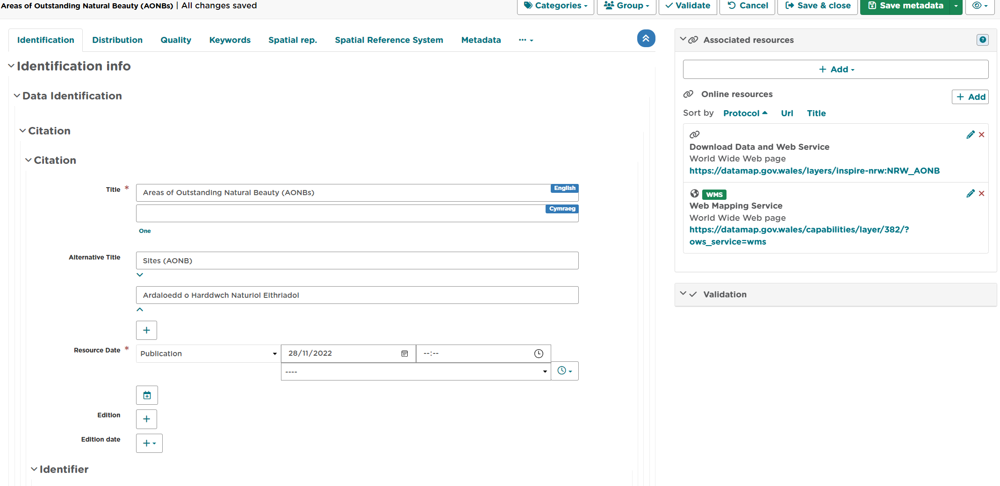
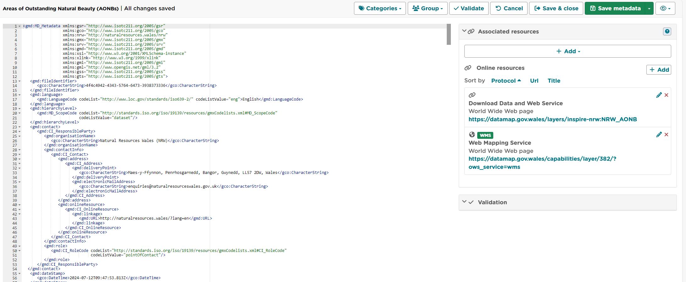
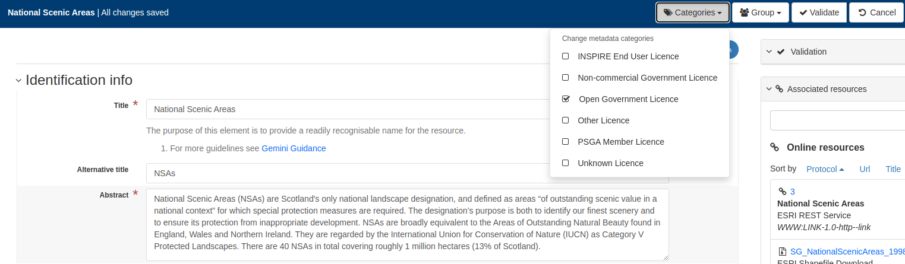
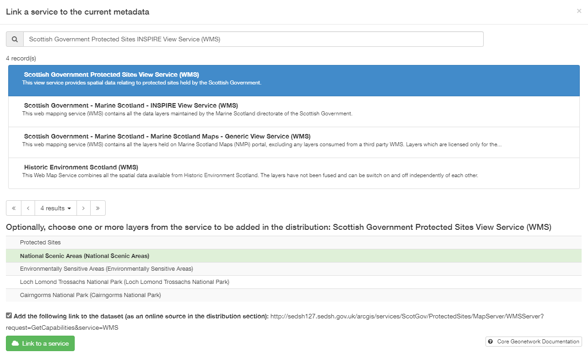
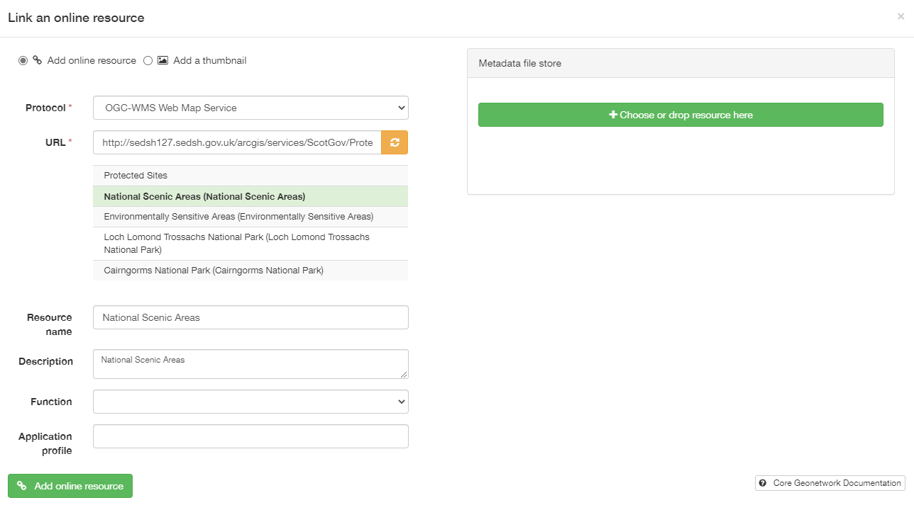
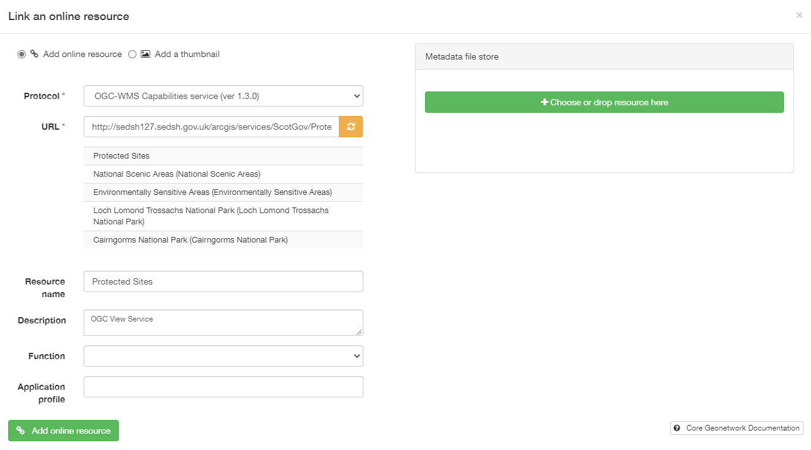
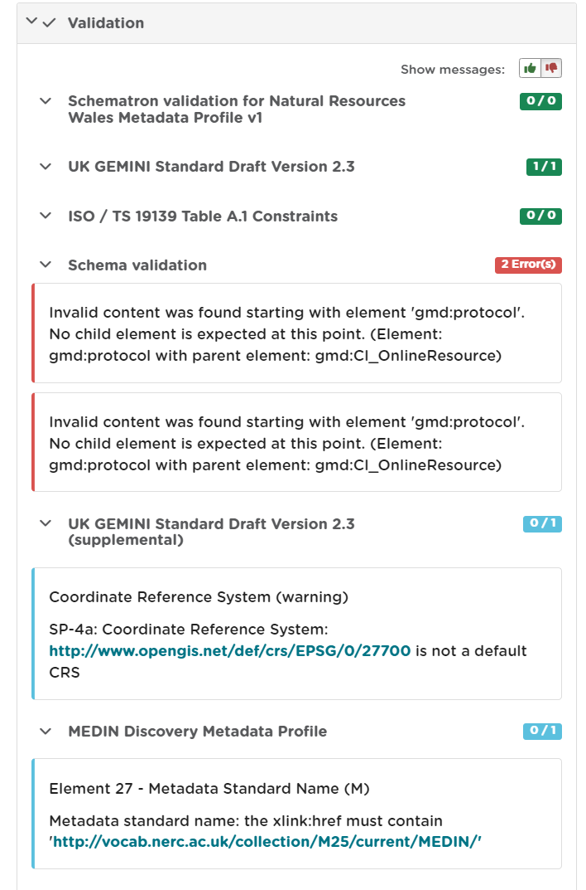
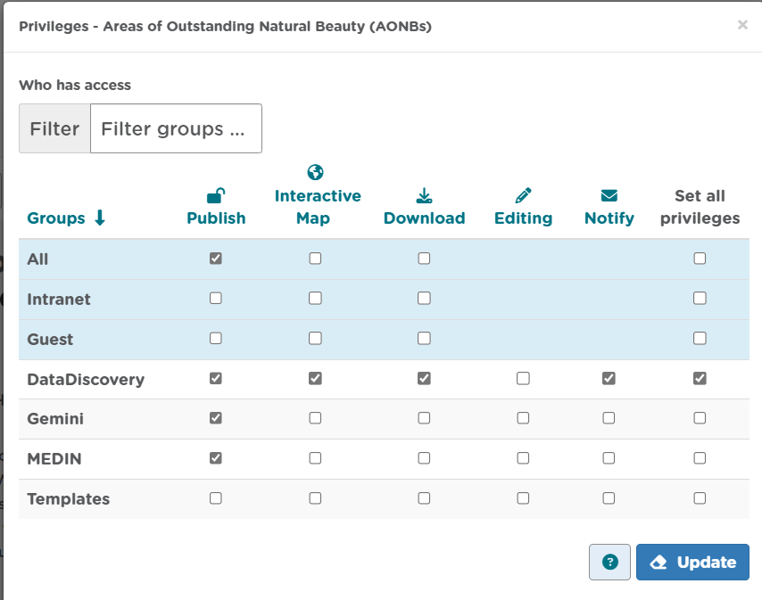
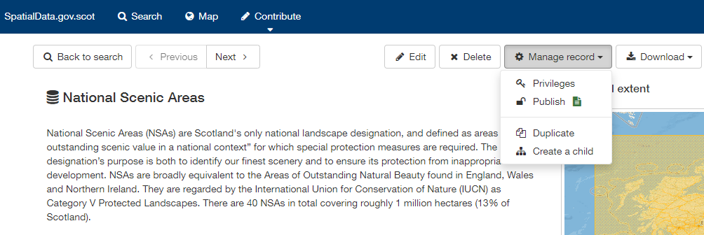
.. |userdoc_fig_6_10_1_NRWDeleteRecordConfirm| image:: media/userdoc_fig_6_10_1_NRWDeleteRecordConfirm.png
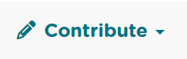

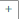

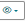
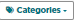

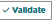

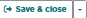
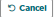
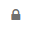
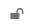
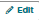
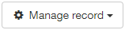
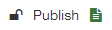

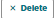

